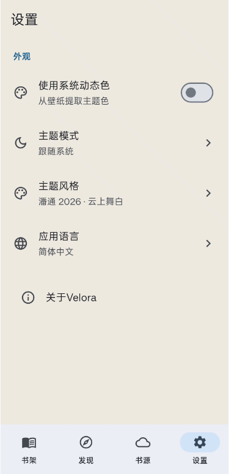
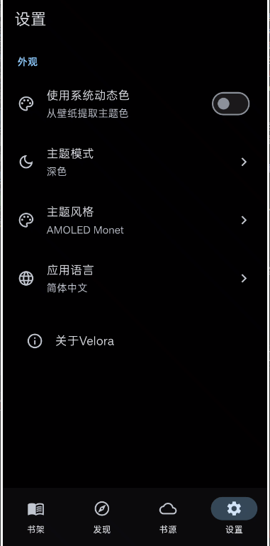
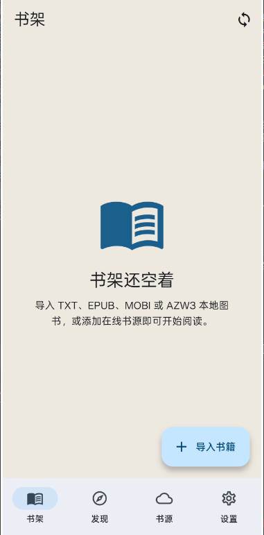
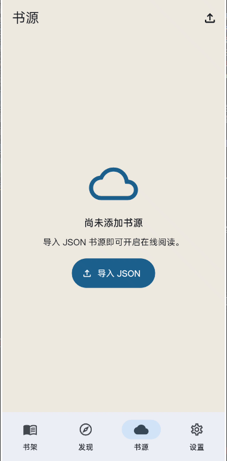

# Velora

<p align="center">
  
</p>

Velora 是一个面向生产环境的跨平台小说阅读器，使用 Flutter 负责界面、动效、导航和平台整合，使用 Rust 负责书籍解析、目录索引、正文读取、在线书源抓取和书架存储。项目围绕本地大文件阅读、Material Design 3 体验、跨语言界面和自动化验证链路进行了完整设计，当前覆盖 Android、iOS、macOS、Windows、Linux、Web。

## 法律与合规声明

本项目仅可用于处理、阅读、调试、研究和验证用户依法享有授权、许可或其他合法权利的内容。严禁将本项目或其任何衍生版本用于抓取、聚合、解析、传播、分享、引流、售卖、推广、镜像、规避保护措施，或以任何直接、间接方式协助获取、分发未经权利人授权的作品、站点资源、书源规则、深度链接规则及其他侵权内容。

请勿效仿、从事或传播任何侵权活动，切勿触碰法律红线，也不要抱有任何侥幸心理。法律底线不可逾越，违法违规必将付出代价；任何以“技术中立”“只做链接”“只提供规则”“仅供学习交流”为名实施的盗版聚合、深度链接侵权、非法引流或变现行为，均不构成免责理由。

结合公开案件披露的信息可见，侵权风险不仅存在于直接上传盗版内容的场景，也存在于通过软件、书源规则、解析逻辑、深度链接、社群传播和商业化引流等方式，对盗版内容进行聚合、适配展示和规模化传播的行为中。相关案件已经表明，此类行为一旦具有明确故意并造成实质性传播与获利后果，可能触及著作权侵权乃至刑事法律责任。

任何用户、开发者、贡献者或分发者在使用、修改、部署、传播本项目时，均应自行确保其行为完全符合所在地及目标市场适用的著作权法、网络安全法、数据合规规则、平台规则及其他法律法规。因将本项目用于任何侵权、违法或违规活动而产生的一切风险、责任、损失与法律后果，均由行为人自行承担，与本项目作者及贡献者无关。

## 产品图

| 亮色主题设置 | 暗色主题设置 |
| --- | --- |
|  |  |
| 书源导入 | 书源管理 |
|  |  |

## 产品能力

- 本地阅读支持 TXT、EPUB、MOBI、AZW3。
- TXT 自动识别 UTF-8、GBK、Big5、Shift_JIS 等常见编码。
- EPUB 按 OPF spine 管理章节顺序并保留章节文本边界。
- MOBI/AZW3 支持未加密、可直接读取文本记录的文件；DRM、HUFF/CDIC 压缩或无法安全解码的输入会明确报错。
- 离线书籍会优先读取 EPUB 内嵌标题、作者和封面；TXT、MOBI、AZW3 等缺失元数据时，可基于书名从公开页面补全标题、作者、简介和封面 URL。
- 在线元数据查找面向 Qidian、Fanqie Novel、Qimao、Tadu、17K、Faloo、GoodNovel、Wuxiaworld、Royal Road 等公开小说页面，只处理书名、作者、简介、封面等基础元数据，不抓取正文内容。
- 在线阅读兼容多种风格书源 JSON，支持搜索、详情、目录、正文抓取和封面 URL 提取。
- `发现` 页在未输入搜索词时，会优先消费启用书源的探索页、发现页和 RSS 订阅结果；如果书源没有探索规则，再自动回退到搜索规则抓取首批可读内容，避免出现“书源已导入但发现页仍为空”的情况。
- 标准 RSS 订阅源开箱即用，只填写 `sourceUrl/sourceName` 也能导入；带 `ruleArticles`、`ruleTitle`、`ruleDescription`、`ruleImage`、`ruleLink`、`ruleContent` 的自定义 RSS 源也会被识别并接入 `发现` 页与书架阅读流。
- 书源导入支持直接粘贴 JSON、HTTP(S) 书源地址、阅读类在线导入链接、YCKCEO 书源详情页地址，以及包含多个 JSON 链接的批量文本输入。
- 书源导入抓取由 Flutter 侧 HTTP 客户端执行，Android 正式构建已补齐 `INTERNET` 权限并放开常见 HTTP 书源访问，避免设备上出现导入请求失败或推荐内容拉取失败。
- Legado 风格搜索模板兼容 `{key}`、`{{key}}`、`{keyword}`、`{{keyword}}`、`{searchKey}` 以及常见分页占位符，并会自动补全相对搜索 URL。
- Legado 风格的 `enabledExplore`、`exploreUrl`、`ruleExplore` 会被持久化并接入 `发现` 页推荐链；`exploreUrl` 中带分类别名和 `{{page}}` 分页模板的配置会自动解析并以第一页作为默认推荐入口。
- 阅读器使用渐进分页与阶段化加载，不在首开时一次性阻塞主线程。
- 本地路径 TXT 现已改为流式编码探测、编码元数据热缓存、64KB 级稀疏行边界锚点、联合 sidecar 持久化缓存、超大章节拆片和按范围读取，100MB 级文本不再依赖整本读入后才能进入阅读页。
- 打开书籍时展示共享容器过渡、骨架屏、进度条和百分比，减少感知卡顿。
- Android 已声明 TXT 外部打开入口，系统“打开方式”与默认应用列表可直接显示 Velora，并会在启动后由原生 I/O 线程把 `content://` 或 `file://` 文档流式镜像到应用私有目录，再交给 Rust 文件路径读取。
- Android 阅读正文新增原生 StaticLayout 分页与绘制通道，并在分页阶段预热最终页布局；阅读器会把当前页与前后页提前做原生预绑定，并持续量化真实翻页路径上的 bind/layout 耗时与预绑定命中率，正文页在 Android 设备上可直接走平台视图渲染与页视图复用池，不再完全依赖 Flutter `Text` 组件参与排版与绘制。
- 阅读器会按书籍、章节、视口和排版参数把已知页断点直接写回 Rust 的 TXT sidecar 联合缓存；sidecar 还会按版式分层记录热门页窗口，并持续回收真实回跳补页跨度、热门窗口命中率和原生页预绑定反馈，让窗口大小与保留策略按实际阅读行为自适应。
- `发现` 页对书源搜索与推荐加载增加了单源超时、批量增量回显、骨架列表、结果项入场动画和列表内刷新进度，不再长时间停留在空白等待态。
- 阅读页支持左右点击翻页、拖拽跟手翻页、目录面板、书签面板和阅读设置；中部点按只负责显示或隐藏工具层。
- 仿真翻页支持实时拖拽跟手、非线性拖拽进度、卷页阴影、高光折痕和章节边界连续衔接。
- 阅读设置支持翻页效果、字号、行高、页边距、阅读字体等持久化配置；字号与行高滑杆改为拖动预览、松手后重排，字体卡片会按实际字体渲染预览。
- 主题系统支持浅色、深色、跟随系统、Pantone 2026 Cloud Dancer、Monet 动态色和 AMOLED。
- 多语言界面当前覆盖简体中文、繁体中文、英文、日文、韩文、德文，设置页只暴露已完整实现的语言。

## 架构概览

- Flutter 层负责应用壳、导航、Material Design 3 组件、响应式布局、状态持久化和平台集成。
- Rust 层负责书籍解析、目录提取、章节读取、在线书源请求与书架存储。
- Flutter 与 Rust 通过 flutter_rust_bridge 通信，阅读器和测试环境都能显式注入动态库、文档目录和 SharedPreferences。
- Android 文档 URI 先在 Kotlin 层以 256KB 缓冲流式复制到应用私有 `files/books` 目录，Dart 层只接收本地路径和元数据，不再接收整本 `Uint8List`。
- TXT 文件访问层只做文件路径、编码样本缓存、mmap 窗口读取和按范围读取；偏移索引层按章节标题与 64KB 级行边界锚点生成稀疏片段，并把章节锚点、整段前缀页断点、按版式分层的热门页窗口以及恢复命中反馈一并写入 Rust sidecar 联合缓存；分页布局层会优先命中 sidecar 中已有的最接近目标页的窗口，再对当前片段渐进分页，并基于真实命中率、补页跨度和原生页耗时自动调整窗口大小与保留数量；显示缓冲层只保留当前章节附近的页面窗口和少量章节缓存。
- Android 设备上的阅读页正文支持 Native StaticLayout 分页、布局预热、前后页原生预绑定、翻页 bind/layout 耗时量化和平台视图复用池；其他平台使用更细粒度的段页绘制模型，而不是直接把整页正文交给单个 Flutter `Text` 组件。
- 阅读器首屏使用渐进分页策略，在帧间主动让出 UI，后续页面按需继续追加，避免大文件打开时整页冻结；同一版式参数下再次打开可直接复用持久化页断点窗口。

## 启动与测试注入机制

本项目的应用启动入口已经拆分为两层：

- `bootstrapVeloraApp` 负责正式启动应用、注入 SharedPreferences、运行 `beforeRun` 钩子并挂载应用树。
- `prepareVeloraBootstrap` 负责可测试的准备阶段，支持显式注入 Rust 外部库、文档目录、SharedPreferences 和存储初始化函数。

这套设计的目标是让集成测试和组件测试不依赖真实平台插件或固定目录：

- Windows VM 下的集成测试会显式加载 `rust/target/debug/deps/rust_lib_velora.dll`。
- 集成测试使用临时文档目录，避免污染真实阅读数据。
- 集成测试使用 mock SharedPreferences，避免缺失插件通道时直接失败。
- Google Fonts 在测试环境中关闭运行时抓取，避免因 `path_provider` 缓存路径缺失导致用例不稳定。

## 图标与品牌资源

仓库中的品牌主图位于 `assets/light.png` 和 `assets/dark.png`。

- `assets/light.png` 作为 Android、iOS、macOS、Windows、Linux、Web 的主应用图标源。
- `assets/dark.png` 作为 Web 深色 favicon 以及 Android adaptive monochrome 图标源。
- Android 已补齐 `roundIcon`、adaptive icon、monochrome icon 和背景色资源。
- Web 已补齐深浅主题 favicon 切换逻辑，并同步更新站点主题色。
- Windows 已生成主图标 `windows/runner/resources/app_icon.ico`，同时保留深色版本 `app_icon_dark.ico` 以便后续扩展原生切换逻辑。
- iOS 与 macOS 的 `AppIcon.appiconset` 已按各尺寸要求重新生成。

图标产物的标准生成入口是：

```powershell
powershell -ExecutionPolicy Bypass -File .\tool\generate_icons.ps1
```

如果执行策略限制脚本运行，也可以在 PowerShell 会话中以内存脚本块方式执行：

```powershell
$script = Get-Content -Raw .\tool\generate_icons.ps1
& ([scriptblock]::Create($script)) -Root (Get-Location)
```

## 平台渲染与图形适配

Velora 不会也不能通过应用仓库直接安装、升级或替换系统级显卡驱动。生产环境里的图形驱动由目标设备操作系统和 GPU 厂商维护，应用侧只能保证渲染链路、资源尺寸、硬件加速开关和引擎接入方式正确。

当前项目采用的渲染适配原则如下：

- Android 由 Flutter 引擎按设备能力在 Vulkan 与 OpenGL ES 路径间选择合适后端，Activity 已开启硬件加速。
- iOS 与 macOS 使用 Flutter 的 Metal 渲染链路。
- Windows 使用 Flutter 桌面嵌入层和系统图形后端。
- Linux 使用 GTK 宿主与 Flutter Linux 嵌入层。
- Web 使用 Flutter Web 运行时与浏览器图形栈。

这意味着应用层已经完成了自己应该承担的适配工作：资源尺寸、图标链路、窗口尺寸、硬件加速、主题适配、阅读页阴影与排版都由仓库代码控制；真正的系统驱动升级仍然必须在操作系统层面完成。

## 目录结构

- `lib/app.dart`：应用根组件、主题注入、本地化与路由挂载。
- `lib/main.dart`：正式启动入口、测试可注入启动准备阶段。
- `lib/features/bookshelf`：书架、导入、封面卡片、打开入口。
- `lib/services/source_recommendations.dart`：发现页默认推荐内容装载。
- `lib/features/reader`：阅读器、渐进分页、Android StaticLayout 通道、页断点持久化缓存、目录、书签、阅读设置、加载过渡。
- `lib/features/settings`：主题、语言、翻页效果和全局配置。
- `lib/router`：主壳层导航与阅读器过渡路由。
- `lib/state`：Riverpod 状态与 SharedPreferences 持久化。
- `lib/theme`：主题色、字体、Motion token 和阅读排版。
- `lib/widgets/page_turn.dart`：翻页状态机、拖拽跟手、卷页阴影和转场表现。
- `rust/src/api/book_file.rs`：本地书籍格式解析、TXT sidecar 锚点缓存与章节读取。
- `rust/src/api/storage.rs`：书架与元数据持久化。
- `integration_test`：设备级路径验证。
- `test`：Dart 单元与组件测试。
- `tool/generate_icons.ps1`：全平台图标生成脚本。

## 自动化测试覆盖

当前已经覆盖以下关键路径：

- 本地书籍打开到阅读页。
- 加载态与直接进入阅读页两种打开路径。
- 界面语言切换为德语后的导航与设置文案更新。
- 阅读页工具栏稳定跳转系统设置页。
- 阅读页阅读设置面板稳定打开并展示字体选项。
- 仿真翻页的点击、调试预览、实际拖拽完成翻页和边界回调。
- 设置页的语言、主题模式和翻页效果切换。
- 启动准备阶段的目录与 SharedPreferences 注入。
- Rust 层对 TXT、EPUB、MOBI 的格式边界验证。

## 开发命令

```powershell
flutter pub get
flutter_rust_bridge_codegen generate --config-file D:\RustProject\velora\flutter_rust_bridge.yaml
flutter analyze D:\RustProject\velora
flutter test D:\RustProject\velora\test
flutter test D:\RustProject\velora\integration_test\reader_flow_test.dart
flutter test D:\RustProject\velora\integration_test\simple_test.dart
cargo check --manifest-path D:\RustProject\velora\rust\Cargo.toml
cargo test --manifest-path D:\RustProject\velora\rust\Cargo.toml
powershell -ExecutionPolicy Bypass -File D:\RustProject\velora\tool\generate_icons.ps1
```

## 当前验证基线

- `flutter analyze D:\RustProject\velora` 通过。
- `flutter test D:\RustProject\velora\test` 通过。
- `flutter test D:\RustProject\velora\integration_test\reader_flow_test.dart` 通过。
- `flutter test D:\RustProject\velora\integration_test\simple_test.dart` 通过。
- `cargo test --manifest-path D:\RustProject\velora\rust\Cargo.toml` 通过。

## 书源 JSON 字段

Velora 当前支持以下核心字段：

```json
{
  "name": "书源名称",
  "url": "https://example.com",
  "enabled": true,
  "book_source_type": 0,
  "source_group": "默认分组",
  "source_icon": "https://example.com/icon.png",
  "enabled_explore": true,
  "explore_url": "男生::/shuku/0_1_0_0_0_{{page}}_0_0",
  "explore_list": ".book",
  "explore_name": ".title",
  "explore_author": ".author",
  "explore_book_url": "a",
  "explore_cover": "img.cover",
  "search_url": "https://example.com/search?q={key}",
  "search_list": ".book",
  "search_name": ".name",
  "search_author": ".author",
  "search_book_url": "a",
  "search_cover": "img.cover",
  "book_info_name": "h1",
  "book_info_author": ".author",
  "book_info_intro": ".intro",
  "book_info_cover": ".cover img",
  "book_info_toc_url": ".toc a",
  "toc_list": ".chapter",
  "toc_name": "a",
  "toc_url": "a",
  "content_selector": "#content",
  "rss_articles": "$.list[*]",
  "rss_title": "$.title",
  "rss_pub_date": "$.pubDate",
  "rss_description": "$.description",
  "rss_image": "$.image",
  "rss_link": "$.link",
  "rss_content": "$.content"
}
```

CSS Selector 会基于响应 URL 自动解析相对链接，正文抓取结果进入统一阅读器分页与进度恢复流程。Velora 也兼容常见的 `bookSourceName`、`bookSourceUrl`、`sourceName`、`sourceUrl`、`searchUrl`、`enabledExplore`、`exploreUrl`、`ruleSearch`、`ruleExplore`、`ruleBookInfo`、`ruleToc`、`ruleContent`、`ruleArticles`、`ruleTitle`、`rulePubDate`、`ruleDescription`、`ruleImage`、`ruleLink` 字段，并会把 `coverUrl` 映射为封面选择器。

如果粘贴内容中包含多个 JSON 链接，Velora 会自动逐个抓取并批量导入；如果粘贴的是 YCKCEO 详情页地址一键导入链接，Velora 会先提取真实 JSON 下载地址再导入。

书架卡片默认只突出格式标签与阅读进度，不再把本地文件大小作为主信息展示；离线书籍在补齐远程封面或内嵌封面后，会优先显示真实封面图。

## 许可证声明

本项目采用 GNU Affero General Public License v3.0 (AGPL-3.0) 进行许可，并在仓库根目录提供完整 `LICENSE` 文本。任何对本项目的复制、修改、再分发、二次开发、托管部署或通过网络向用户提供服务的行为，均应遵守 AGPL-3.0 的强制开源要求，并向接收者或服务使用者提供对应版本的完整源代码、修改说明及许可证文本。

本项目不授权任何人使用 Velora 或其衍生版本实施侵权、规避技术保护措施、聚合盗版资源、传播未经授权作品、非法引流或商业化变现。上述合规限制不削弱 AGPL-3.0 赋予的自由软件权利，而是作为项目用途边界、风险告知和附加合规声明存在。

Copyright (C) 2026-present blueokanna